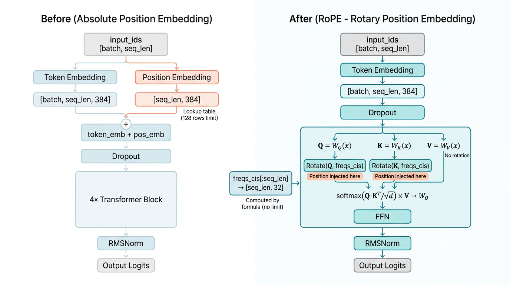
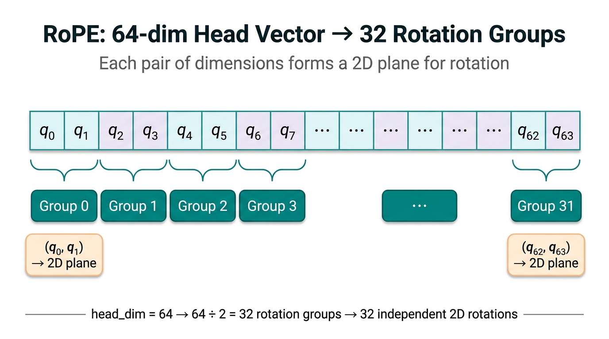
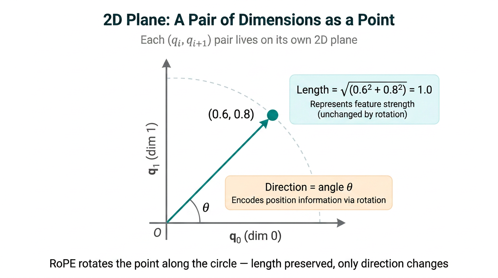
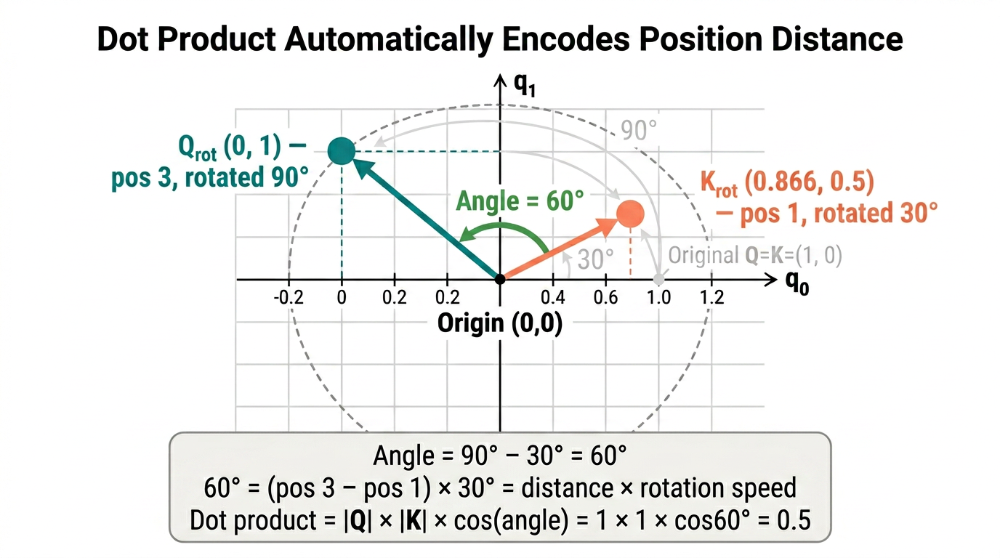
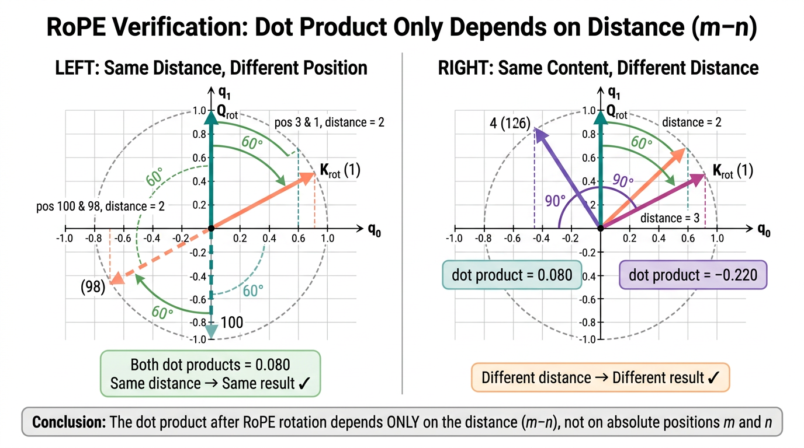

# 工程化叙事讲透：模型 8K 上下文长度如何在推理时扩展到 128K

> **作者**：高翔龙

---

01、token 为什么需要位置编码

本文续接《五万字工程化叙事讲透 Decoder-Only Transformer 架构》。在上篇文章中我们知道，token_embedding 本质上是一张按 token_id 索引的字义查找表。同一个 token，不管它出现在上下文中的什么位置，查出来的向量完全一样，如下所示：

```python
# model.py — NovaModel
self.token_emb = nn.Embedding(config.vocab_size, config.d_model)
# 16000 行 × 384 列的查找表，索引是 token ID，不是位置
x = self.token_emb(input_ids)  # [batch, seq_len, 384]
```

这带来了一个非常致命的问题。"我喜欢你"和"你喜欢我"包含完全相同的三个 token，只是顺序不同，但 token_embedding 查出来的向量集合完全一样。而后续多头自注意力中的 QK 点积，做的是集合运算——对输入顺序天然不敏感。把 token 打乱顺序，关联度矩阵只是行列重新排列，数值本身不变。为什么？因为 Q 和 K 都由输入向量 x 线性投影而来，如下所示：

```python
# model.py — MultiHeadAttention.forward
q = self.w_q(x)  # Q = W_Q · x
k = self.w_k(x)  # K = W_K · x
```

而 x 来自 token_embedding 查表，只取决于 token_id，和位置无关。"我"不管在位置 0 还是位置 2，W_Q · x 的结果完全一样。说白了，QK 点积矩阵里只包含语义关联度——语义相似的向量在空间中天然靠近，但完全不包含距离关联度。没有位置编码的 Decoder-Only，本质上就是一个词袋模型（Bag of Words）：知道句子里有哪些词，但不知道先后顺序。

然而自然语言是强顺序依赖的。相同的 token 出现在上下文的不同位置，天然就承载着不同的语义——"猫吃鱼"和"鱼吃猫"含义截然不同。一个不知道顺序的模型根本无法理解语言，所以 Decoder-Only 必须通过某种方式把位置信息注入进去。这就是位置编码（Positional Encoding）要解决的最核心的问题。

02、绝对位置编码

既然 token_embedding 只编码了语义信息，那我们还需要另一种机制来告诉模型"这个 token 出现在上下文中的第几个位置上"。业界目前主流的位置编码方式有两种：绝对位置编码和相对位置编码。先从绝对位置编码讲起。

Nova 改造前的做法，是单独建一张 position_embedding 位置查找表——每个位置（0, 1, 2, ..., max_seq_len-1）对应一组 d_model 维的向量，然后把 position_embedding 和 token_embedding 直接逐元素相加，作为进入 Block 层的最初输入向量。这也是 GPT-2 采用的可学习绝对位置嵌入（Learned Absolute Position Embedding）方案，Nova 的实现如下所示：

```python
# 改造前的 model.py（GPT-2 方案）
self.token_emb = nn.Embedding(config.vocab_size, config.d_model)   # 字义表：16000 行 × 384 列
self.pos_emb   = nn.Embedding(config.max_seq_len, config.d_model)  # 位置表：128 行 × 384 列

# forward
x = self.token_emb(input_ids) + self.pos_emb(positions)
# positions = [0, 1, 2, ..., seq_len-1]
```

这张位置表和 token_embedding 一样是可学习的——表里的数字初始化为随机值，训练过程中通过反向传播由 AdamW 优化器持续更新。训练完成后，每个位置都有一组学到的 384 维向量，用来告诉模型该 token 在上下文中的具体位置。从实现上看，这套方案非常简单直观：无非就是多查一张表、多做一次加法，就能给模型注入位置感知能力，而且在训练上下文长度范围内的表现也确实不错。

但绝对位置编码有三个绕不开的问题。

第一个问题是语义污染。token_embedding 查出来的向量，每个维度都编码了这个 token 的某种语义特征；而 pos_emb 是另一组完全不同含义的数值。两者直接相加后，原始的语义特征就被位置数值"搅和"了，如下所示：

```
token_emb["你"] = [0.3, 0.7, -0.1, 0.5]     ← 原始语义特征
pos_emb[2]      = [0.9, 0.1, 0.0, -0.2]     ← 位置信息

相加后的输入    = [1.2, 0.8, -0.1, 0.3]     ← 语义 + 位置 混在一起了
                   ↑              ↑
            0.3→1.2          0.5→0.3
```

原来第 0 维是 0.3，加完变成了 1.2；第 3 维从 0.5 变成了 0.3。后续的 W_Q、W_K 矩阵拿到的已经是一个语义和位置混杂在一起的向量，模型需要自己学着把两者分开——这给学习增加了不必要的负担。

第二个问题是向量长度被篡改。在向量空间中，一个向量的长度（L2 范数）代表这个特征有多"强"——值越大，特征越显著。两个向量相加后，新向量的长度几乎不可能等于原来的长度，如下所示：

```
原始语义向量长度 = √(0.3² + 0.7² + 0.1² + 0.5²) = √(0.84) = 0.917
位置向量长度     = √(0.9² + 0.1² + 0.0² + 0.2²) = √(0.86) = 0.927
相加后向量长度   = √(1.2² + 0.8² + 0.1² + 0.3²) = √(2.18) = 1.476
```

长度从 0.917 膨胀到了 1.476，涨了 61%。更糟糕的是，不同位置的 pos_emb 值不同，相加后向量长度的变化幅度也不同——位置 0 可能涨 20%，位置 5 可能涨 80%。说白了，改变了长度就等于把向量特征的强弱篡改了，给后续的归一化和注意力计算凭空增加了噪音。

如果说前面两个问题还算"不致命"的话，第三个问题才是真正的硬伤：**位置表有上限——训练多长，推理就只能多长。** 位置表是一张固定大小的查找表，有多少行就只能表示多少个位置，如下所示：

```python
self.pos_emb = nn.Embedding(config.max_seq_len, config.d_model)
# max_seq_len = 128 → 表只有 128 行（位置 0 到 127）
# 推理时如果输入了 200 个 token，位置 128~199 没有对应的行可以查，直接越界报错
```

为了避免越界，推理时必须强制截断上下文，只保留最近的 max_seq_len 个 token，如下所示：

```python
# 改造前的 chat.py — 推理截断
ids_cond = ids[:, -model.pos_emb.weight.shape[0]:]  # 超出 128 就截掉前面的 token
```

这意味着，训练时用多长的上下文，推理时就只能用多长。位置表 n 行，推理上下文就只有 n 个 token。想要更长的上下文？只能重新用更大的 max_seq_len 训练，而且表里新增的行都是从零开始学的，需要大量数据和训练时间。对于 Nova 这种千万参数的微型 LLM 来说，为了延长上下文而重新训练所带来的成本，已经是相当昂贵的了。


03、相对位置编码

既然绝对位置编码的上限问题绕不过去，那不妨换一个角度来思考这件事：模型真正需要的，究竟是"这个 token 在第几个位置"，还是"两个 token 之间隔了多远"？

举个例子。句子 A 是"今天天气真好啊"，"天气"在位置 1，"好"在位置 3，距离 = 2；句子 B 是"我觉得今天天气真好啊"，"天气"跑到了位置 3，"好"跑到了位置 5，但它们之间的距离依然是 2。从语义理解的角度看，"天气"和"好"之间的语法关系（主语与形容词之间的修饰关系）并没有因为前面多了几个词就发生改变。模型需要学到的是"距离为 2 的 token 之间的关系模式"，而不是"第 1 个位置和第 3 个位置的关系模式"。

这就是相对位置编码（Relative Positional Encoding）的核心思想：不给每个 token 打固定位置标签，而是让模型在计算注意力分数时，能够感知两个 token 之间的距离差 (m - n)。

RoPE（Rotary Position Embedding，旋转位置编码）是当前最主流的相对位置编码实现方案，LLaMA、DeepSeek、Qwen、Gemma 等几乎所有现代大模型都在用它。它的做法从根本上不同于绝对位置编码——不往输入向量上叠加位置信息，而是在 Attention 内部，对 Q 和 K 向量按当前 token 的位置做旋转操作。

为什么偏偏选旋转？因为旋转这个几何操作天然具备三个数学性质，刚好对应解决了绝对位置编码的三个硬伤。其一，旋转只改变向量的方向，不改变向量的长度，所以原始语义特征的"强度"完好无损地保留了下来，不会像加法那样把量级篡改掉。其二，位置 m 的 Q 被旋转了 mθ 度，位置 n 的 K 被旋转了 nθ 度，当 Q·K 做点积时，结果里会自然出现 cos((m-n)θ)——这不是人为设计的，而是三角恒等式 cosA·cosB + sinA·sinB = cos(A-B) 的数学性质决定的，(m-n) 就是两个 token 的相对距离，模型通过点积大小间接感知到了这个距离。其三，旋转角度用公式"角度 = 位置 × 单位旋转角度"计算，不需要查表，任何位置都能算出旋转角度，不存在"表不够长"的问题；再配合位置插值（Position Interpolation）技术，甚至可以在推理时把上下文长度扩展到训练长度的数倍。加法、乘法、拼接都做不到这三点，这也是 RoPE 被称为"优雅"的真正原因。

下面这张架构对比图，可以很直观地看出绝对位置编码和 RoPE 在模型数据流上的差异：



对应到 Nova 的代码，改造前后的关键差异如下所示：

```python
# ======== 改造前（绝对位置编码） ========
# model.py — NovaModel.__init__
self.token_emb = nn.Embedding(config.vocab_size, config.d_model)
self.pos_emb   = nn.Embedding(config.max_seq_len, config.d_model)  # ← 128行位置表

# model.py — NovaModel.forward
x = self.token_emb(input_ids) + self.pos_emb(positions)            # ← 加法注入位置

# model.py — MultiHeadAttention.forward
attn_output = scaled_dot_product_attention(q, k, v, ...)           # ← Q、K 直接点积，不做旋转


# ======== 改造后（RoPE） ========
# model.py — NovaModel.__init__（第 413~434 行）
self.token_emb = nn.Embedding(config.vocab_size, config.d_model)
freqs_cis = precompute_rope_freqs(head_dim, config.max_seq_len, ...)
self.register_buffer("freqs_cis", freqs_cis)                       # ← 旋转系数表（不参与训练）

# model.py — NovaModel.forward（第 486~498 行）
x = self.token_emb(input_ids)                                      # ← 只查字义表，不做加法
freqs_cis = self.freqs_cis[:seq_len]                                # ← 截取当前长度的旋转系数
for block in self.blocks:
    x = block(x, freqs_cis)                                        # ← 旋转系数透传到每层 Block

# model.py — MultiHeadAttention.forward（第 305~306 行）
q, k = apply_rotary_emb(q, k, freqs_cis)                           # ← 点积之前，先对 Q 和 K 做旋转
attn_output = scaled_dot_product_attention(q, k, v, ...)            # ← 然后才做点积
```

简单概括一下这两节的核心结论：绝对位置编码通过加法给每个 token 打上固定位置标签，简单但有上限；相对位置编码（RoPE）通过旋转让模型感知 token 之间的距离差，既不破坏内容，又没有长度限制。这也是为什么当今主流大模型几乎全部转向了 RoPE——它是目前唯一一种既不破坏原始语义、又能让点积自动感知相对距离、同时支持上下文扩展的位置编码方案。

---

04、RoPE 的几何直觉

上一节我们知道了 RoPE 通过"旋转"来编码位置，也提到了它的三个天然优势。但"旋转"到底是什么？它在向量空间里是怎么操作的？为什么旋转就能编码位置？这一节把 RoPE 的几何直觉彻底拆开。

在 Nova 模型中，每个自注意力头负责 head_dim = 64 维的向量空间。RoPE 的第一步，是把这 64 个维度两两配对，分成 32 组：



每一组就是两个数字，比如第 0 组是 (q0, q1)。把这两个数字当成二维平面上一个点的坐标——q0 是横坐标，q1 是纵坐标，就是数学课上画的那个十字坐标系。从原点 (0, 0) 到点 (0.6, 0.8) 画一条线，这条线就是一个向量。每个向量有两个属性：长度（到原点的距离）代表这对维度的语义特征有多"强"，方向（跟横轴的夹角 θ）代表这对维度的语义特征的"指向"。



所谓"旋转"，就是把这个点沿着以原点为圆心的圆弧滑动一个角度。转完之后，点到原点的距离没变（还在同一个圆上），但方向变了：


RoPE 做的事就是：把每个 token 的 Q/K 向量中的 32 组配对，各自在对应的二维平面上旋转一个角度。旋转的角度由 token 的位置决定——位置越靠后，旋转的角度越大。位置 0 的 token 不旋转（角度 = 0），位置 1 的 token 转一小段，位置 100 的 token 转了很多。这样一来，不同位置的 token 即使内容完全相同，旋转后的向量方向也不同——位置信息就被编码进去了。这里有一个关键细节：步长固定为 2（每 2 个维度组成一组），这不是一个可以调的超参数，而是旋转数学本身的要求——旋转是一个平面操作，需要 (x, y) 两个坐标才能定义一个平面上的点，一个数字没有"方向"的概念，无法旋转。所有使用 RoPE 的主流大模型（LLaMA、DeepSeek、Qwen、Gemma）步长全部都是 2，没有例外。

接下来展开说说上一节提到的三个优势，为什么旋转能刚好解决绝对位置编码的三个硬伤。

第一个优势是不破坏内容。上一节我们看到，绝对位置编码的加法会把向量长度从 0.917 膨胀到 1.476，而向量长度代表的是语义特征的"强度"。旋转操作天然保持向量长度不变，这不是人为设计的，而是旋转的数学定义决定的，证明过程如下：

```
原始向量 (a, b)，长度² = a² + b²

旋转 θ 度后的新向量：
  new_a = a×cosθ - b×sinθ
  new_b = a×sinθ + b×cosθ

新向量的长度²：
  = (a×cosθ - b×sinθ)² + (a×sinθ + b×cosθ)²
  = a²cos²θ - 2ab·cosθsinθ + b²sin²θ + a²sin²θ + 2ab·sinθcosθ + b²cos²θ
                ↑ 这两项正好抵消 ↑
  = a²(cos²θ + sin²θ) + b²(sin²θ + cos²θ)
  = a² × 1 + b² × 1                          ← cos²θ + sin²θ = 1，三角恒等式
  = a² + b²

新长度² = 原始长度²，所以长度不变。对任意角度 θ 都成立。
```

拿前面的例子验证一下：(0.6, 0.8) 旋转 90° 后变成 (-0.8, 0.6)，旋转前长度 = √(0.36 + 0.64) = 1.0，旋转后长度 = √(0.64 + 0.36) = 1.0，完全一致。说白了，旋转后 token 的语义特征"强度"原封不动地保留了下来，位置信息纯粹通过方向的改变来编码。就像时钟的秒针——针的长度不变，但指向不断旋转，不管指向 12 点还是 3 点，秒针还是那根秒针（长度/内容不变），你通过它指的方向就知道时间（位置信息）。


如图6所示，第二个优势是自动编码相对距离。这是 RoPE 最精髓的性质。两个向量的点积有一个几何含义：A · B = |A| × |B| × cos(A 和 B 之间的夹角)。也就是说，点积的大小取决于两件事：向量的长度（代表内容）和它们之间的夹角（代表方向差异）。现在假设位置 m 的 Q 和位置 n 的 K 分别被旋转了 mθ 和 nθ 度，旋转不改变长度，但改变了方向。那么旋转后 Q 和 K 之间的夹角是：

```
旋转前：Q 的方向 = α，  K 的方向 = β，  夹角 = α - β（纯内容的方向差）
旋转后：Q 的方向 = α + mθ，K 的方向 = β + nθ

旋转后的夹角 = (α + mθ) - (β + nθ) = (α - β) + (m - n)θ
                                        ↑           ↑
                                    内容方向差    位置距离 × 单位旋转角度
```

旋转后的夹角由两部分组成：内容方向差 (α - β) 和位置距离贡献 (m-n)θ。代入点积公式就是：Q_旋转 · K_旋转 = |Q| × |K| × cos((α - β) + (m - n)θ)。关键在最后一项 (m - n)θ——不管 m 和 n 各自是多少，点积只取决于它们的差 (m-n)。位置 3 和位置 1 的距离是 2，位置 103 和位置 101 的距离也是 2，它们对点积的贡献完全一样。这就是 RoPE 的核心：旋转编码的是绝对位置（每个 token 各转各的），但点积只看角度差，所以最终效果是编码了相对距离。这不是人为设计的，是旋转几何的天然性质。在数值上也很直观——位置差越小，夹角越小，cos 越接近 1，点积越大，注意力越高；位置差越大，夹角越大，cos 越接近 0，点积越小，注意力越低。这完美符合自然语言中"临近词通常更相关"的先验知识。

第三个优势是无长度上限。绝对位置编码的 nn.Embedding(128, 384) 有 128 行，位置 128 以后没有行可查。而 RoPE 的旋转角度用公式计算：角度 = 位置 × 单位旋转角度。不管位置是 0、128 还是 100000，代入公式都能算出一个角度，不需要查表，自然没有上限。当然，"能算出角度"不等于"效果一定好"——模型的 W_Q、W_K 等权重只在训练长度范围内优化过，直接用超出训练范围的位置可能导致注意力模式崩掉。但 RoPE 至少提供了一个扩展的可能性：配合位置插值技术（后续章节会详解），可以把旋转角度压缩回训练范围，从而在推理时把上下文长度扩展到训练长度的 2~4 倍。这是绝对位置编码完全做不到的事。

理解了旋转的几何直觉之后，接下来看看它在代码层面到底是怎么算的。"旋转"听起来很抽象，但翻译成最底层的计算操作，就是两次乘法和一次加减法，没有任何神秘的东西。忘掉"旋转"这个词，忘掉复数，看最底层到底发生了什么：

```
你有一个 Q 向量中的一组配对：q0 = 0.6, q1 = 0.8
你有一张预计算好的旋转系数表，这一组对应的系数是：cos值 = 0.540, sin值 = 0.841

"旋转"就是这两行算术：
  new_q0 = q0 × cos值 - q1 × sin值 = 0.6 × 0.540 - 0.8 × 0.841 = 0.324 - 0.673 = -0.349
  new_q1 = q0 × sin值 + q1 × cos值 = 0.6 × 0.841 + 0.8 × 0.540 = 0.505 + 0.432 =  0.937

就这样。每个数字经过 2 次乘法、1 次加或减，得到一个新数字。结束了。
```

写成通用形式就是：new_q0 = q0 × cosθ - q1 × sinθ，new_q1 = q0 × sinθ + q1 × cosθ，其中 θ = 位置 × 单位旋转角度。这不是什么新发明，就是初中解析几何的平面旋转公式。上面的例子中，cos 值 = 0.540、sin 值 = 0.841 对应的角度是 1.0 弧度（约 57.3°），即这个 token 在这组维度上旋转了 1.0 弧度。验证一下旋转后长度有没有变：旋转前 √(0.6² + 0.8²) = 1.0，旋转后 √(0.349² + 0.937²) = 1.0，确实没变。

现在来看完整的旋转过程。假设 head_dim = 4（为了简单，实际是 64），分成 2 组，位置 = 2 的某个 token：

```
原始 Q 向量 = [0.6, 0.8, 0.3, -0.5]
                ↑    ↑    ↑     ↑
              组0的a 组0的b 组1的a 组1的b

旋转系数表（位置 2 对应的系数）：
  组0：cos值 = 0.540, sin值 = 0.841   ← 快速组（单位旋转角度大，每步转很多度）
  组1：cos值 = 0.980, sin值 = 0.200   ← 慢速组（单位旋转角度小，每步只转一点）

旋转操作（每组独立做，互不影响）：

  组0：(0.6, 0.8) → 代入旋转公式
    new_q0 = 0.6×0.540 - 0.8×0.841 = 0.324 - 0.673 = -0.349
    new_q1 = 0.6×0.841 + 0.8×0.540 = 0.505 + 0.432 =  0.937

  组1：(0.3, -0.5) → 代入旋转公式
    new_q2 = 0.3×0.980 - (-0.5)×0.200 = 0.294 + 0.100 = 0.394
    new_q3 = 0.3×0.200 + (-0.5)×0.980 = 0.060 - 0.490 = -0.430

旋转后的 Q 向量 = [-0.349, 0.937, 0.394, -0.430]

验证长度没变（每组独立验证）：
  组0旋转前：√(0.6² + 0.8²)     = √1.000 = 1.000
  组0旋转后：√(0.349² + 0.937²) = √1.000 = 1.000  ✓

  组1旋转前：√(0.3² + 0.5²)     = √0.340 = 0.583
  组1旋转后：√(0.394² + 0.430²) = √0.340 = 0.583  ✓
```

这里有一个重要细节：组 0 和组 1 用的旋转系数是不同的。组 0 是"快速组"——每步转很多度，相邻 token 的方向差别大，擅长捕捉近距离关系；组 1 是"慢速组"——每步只转一点点，要隔很远才能看出方向差别，擅长捕捉远距离关系。实际的 Nova 模型有 32 组，从最快的 θ₀ = 1.0 到最慢的 θ₃₁ = 0.000132，32 组分工协作，覆盖从 1 步到几千步的距离感知范围。推广到实际的 head_dim = 64 维向量，旋转操作的完整过程如下：

```
对于 head_dim = 64 的向量，分成 32 组，每组 2 个数字：
  [q0,q1], [q2,q3], [q4,q5], ..., [q62,q63]
     ↓         ↓         ↓              ↓
  2次乘加    2次乘加    2次乘加    ...  2次乘加      ← 每组用各自的 (cos值, sin值)
     ↓         ↓         ↓              ↓
  [q0',q1'], [q2',q3'], [q4',q5'], ..., [q62',q63']

每组独立做，互不干扰。32 组共做 32 × 4 = 128 次乘法 + 64 次加减法。
输入形状 [batch, n_heads, seq_len, 64]，输出形状 [batch, n_heads, seq_len, 64]
—— 和输入完全一样，下游的点积、softmax、加权求和完全无感知。
```

到这里还有一个问题绕不过去：前面一直在说"角度"，但角度是一个几何概念——你没法拿"1.0 弧度"这个数字直接去跟 Q 向量做矩阵运算，GPU 也不认识"旋转 57.3°"这种指令。要让旋转真正落地到计算上，必须把角度转换成 cos 和 sin 这两个实数系数，才能代入旋转公式 new_q0 = q0×cosθ - q1×sinθ 跟 Q/K 做乘加运算。

这一步在 Nova 的代码里对应的就是 `torch.polar`——把每个位置的每组角度，预先算好对应的 cos 和 sin，打包成一张旋转系数表 freqs_cis。没有这一步，Q 和 K 就无法完成旋转，如下所示：

```python
# model.py — precompute_rope_freqs（第 191~202 行）

# 把角度转为 cos/sin 系数，用复数形式打包：e^(i×angle) = cos(angle) + i×sin(angle)
# 例如 angle = 1.0 弧度 → torch.polar(1.0, 1.0) = 0.540 + 0.841i
#                                                    ↑cos     ↑sin
freqs_cis = torch.polar(torch.ones_like(angles), angles)
# freqs_cis 的形状 [max_seq_len, 32]，每个元素是一个复数，打包了该位置该组的 cos 和 sin
```

这里用复数格式 cos + sin·i 来存储 (cos, sin) 这一对系数，不是因为旋转跟复数有什么神秘关系，纯粹是一个工程上的打包技巧。因为 PyTorch 的复数乘法 (a + bi) × (c + di) = (ac - bd) + (ad + bc)i，其中实部 ac - bd 跟旋转公式 new_q0 = q0×cosθ - q1×sinθ 的结构一模一样，虚部 ad + bc 跟 new_q1 = q0×sinθ + q1×cosθ 也一模一样。换句话说，只要把 (q0, q1) 打包成复数 q0 + q1·i，把 (cosθ, sinθ) 打包成复数 cosθ + sinθ·i，一次复数乘法就等价于一次旋转——32 组的旋转用一行向量化操作就能全部搞定，比手写 for 循环快得多。Nova 中实际执行旋转的代码如下所示：

```python
# model.py — apply_rotary_emb（第 206~233 行）

# 1. 把 Q 向量的 head_dim=64 维两两配对，塞进复数容器
#    [batch, n_heads, seq_len, 64] → [batch, n_heads, seq_len, 32]（每个元素是复数）
q_complex = torch.view_as_complex(q.float().reshape(*q.shape[:-1], -1, 2))
k_complex = torch.view_as_complex(k.float().reshape(*k.shape[:-1], -1, 2))

# 2. 逐元素复数乘法 = 32 组同时完成旋转
q_rotated = torch.view_as_real(q_complex * freqs_cis).flatten(-2)
k_rotated = torch.view_as_real(k_complex * freqs_cis).flatten(-2)
# 拆回实数后 flatten 恢复为 [batch, n_heads, seq_len, 64]，形状和输入完全一样
```

所以整条链路可以概括为：先用外积算出每个位置的旋转角度（几何量，不能直接计算），再用 torch.polar 把角度转成 cos/sin 系数（实数，可以计算），最后用复数乘法把 cos/sin 系数一次性作用到 Q 和 K 上完成旋转。说到底，"旋转"翻译成计算语言，就是把 head_dim 维的向量分成 32 对，每对用各自的 (cosθ, sinθ) 做两次乘加——本质和矩阵乘法一样，就是普通的乘加运算，只不过它恰好具备"不改长度、只改方向"的几何性质，让位置信息可以优雅地编码进 Q 和 K 向量中。

---

05、RoPE 的工程实现

上一节从几何直觉和计算公式两个层面把旋转讲清楚了，这一节沿着 Nova 的源码，完整走一遍 RoPE 从预计算到实际旋转的工程实现链路。对应的核心函数是 model.py 中的 `precompute_rope_freqs`（第 133~202 行），它在模型初始化时只调用一次，算好一张旋转系数表注册为 buffer，后续每次前向传播直接查表使用，不参与反向传播，不消耗训练显存，也不影响训练速度。

首先要算出 32 组单位旋转角度。所谓"单位旋转角度"，就是每往后走一个位置，这一组维度对要转多少度。32 组的单位角度各不相同，从 1.0（每步转很多）指数递减到 0.000132（每步几乎不转），目的是让不同组分工协作——大步长的组擅长捕捉近距离关系，小步长的组擅长捕捉远距离关系。计算公式是 freqs = 1 / (theta ^ 比例)，其中 theta 是基数（业界标准值 10000），比例是 0~1 之间的等差序列。具体分三步算，如下所示：

```python
# model.py — precompute_rope_freqs（第 158 行）
freqs = 1.0 / (theta ** (torch.arange(0, head_dim, 2).float() / head_dim))
```

```
拆解这一行代码的计算过程：

第1步，算比例：64 个维度两两配对分成 32 组，组编号 [0,2,4,...,62] 除以 64，得到 0~1 之间的比例
  [0/64, 2/64, 4/64, ..., 62/64] = [0.0, 0.03125, 0.0625, ..., 0.96875]

第2步，算基数的幂：10000 ^ 比例，比例越大结果越大
  10000^0.0 = 1 → 10000^0.03 = 1.318 → ... → 10000^0.5 = 100 → ... → 10000^0.97 = 7586

第3步，取倒数得到单位旋转角度：
  1/1 = 1.0（大步长，近距离敏感）→ 1/100 = 0.01 → 1/7586 = 0.000132（小步长，远距离敏感）

最终 32 个单位角度从 1.0 指数递减到 0.000132
freqs = [1.0, 0.759, 0.575, ..., 0.01, ..., 0.000132]
```

为什么要用指数递减而不是线性递减？因为自然语言中近距离关系（主谓、动宾等）出现频率远高于远距离关系（跨段落指代等），指数分布可以让更多的组集中服务于近距离感知，同时保留少数慢速组覆盖远距离，这和傅里叶变换中高频到低频的分布逻辑是类似的。

有了单位角度之后，接下来要算每个位置的真实旋转角度。单位角度表示的是"每走一步转多少度"，真实角度则是"这个位置实际要转多少度"。关系很简单：真实角度 = 位置 × 单位角度。用 torch.outer（外积）一次性算出所有位置 × 所有组的角度矩阵，如下所示：

```python
# model.py — precompute_rope_freqs（第 168~189 行）

# 生成位置编号序列
t = torch.arange(max_seq_len, dtype=torch.float32)   # [0, 1, 2, ..., 127]

# 外积：每个位置 × 每个单位角度 = 真实旋转角度
angles = torch.outer(t, freqs)   # [128, 32]
```

```
angles 是一张 128 行 × 32 列的角度表，展开来看：

              组0(快=1.0)  组1(=0.759)  ...  组31(慢=0.000132)
位置 0 的角度：  0×1.0=0     0×0.759=0    ...  0×0.000132=0
位置 1 的角度：  1×1.0=1.0   1×0.759=0.759 ... 1×0.000132=0.000132
位置 2 的角度：  2×1.0=2.0   2×0.759=1.518 ... 2×0.000132=0.000264
  ...
位置127的角度：  127×1.0=127  127×0.759=96.4 ... 127×0.000132=0.01676

竖着看每一列：同一组内，位置越靠后角度越大（转得越多）
横着看每一行：同一位置上，组0 转得最多，组31 转得最少
```

角度表算好之后，还不能直接拿去用——上一节讲过，角度是几何量，不能直接跟 Q/K 做矩阵运算，必须先转成 cos/sin 系数。torch.polar 做的就是这件事：把每个角度变成一个复数 cos(angle) + sin(angle)·i，打包存储 (cos, sin) 这对系数，如下所示：

```python
# model.py — precompute_rope_freqs（第 200 行）
freqs_cis = torch.polar(torch.ones_like(angles), angles)
# 形状 [128, 32]，每个元素是一个复数，包含了该位置该组的 cos 和 sin 系数
```

整张 freqs_cis 表在模型初始化时算好，注册为 buffer 跟随模型保存和加载。前向传播时，只需按当前序列长度截取对应的行即可，如下所示：

```python
# model.py — NovaModel.__init__（第 425~434 行）
freqs_cis = precompute_rope_freqs(head_dim, config.max_seq_len, theta=config.rope_theta, ...)
self.register_buffer("freqs_cis", freqs_cis)   # 注册为 buffer，不参与训练

# model.py — NovaModel.forward（第 494 行）
freqs_cis = self.freqs_cis[:seq_len]            # 截取当前长度，推理时 seq_len 可能小于 max_seq_len
```

最后一步就是实际应用旋转。拿到 freqs_cis 之后，在多头自注意力的 QK 点积之前，对 Q 和 K 分别施加旋转。注意，V 不旋转——因为 V 是"实际提供的内容"，位置信息只需要编码进 Q（我在找什么）和 K（我能提供什么）中，通过 QK 点积来影响注意力权重就够了。旋转后的 Q 和 K 进入正常的点积 → 缩放 → 因果掩码 → softmax → 加权求和流程，下游完全无感知，如下所示：

```python
# model.py — MultiHeadAttention.forward（第 305~306 行）
q, k = apply_rotary_emb(q, k, freqs_cis)         # Q 和 K 各自按位置旋转，V 不旋转
attn_output = F.scaled_dot_product_attention(q, k, v, ...)  # 然后才做 QK 点积
```

把整条链路串起来：算 32 组单位旋转角度（freqs）→ 外积算每个位置的真实角度（angles）→ 转成 cos/sin 系数表（freqs_cis）→ 在 Attention 内部旋转 Q 和 K（apply_rotary_emb）。预计算只做一次，每次前向传播只查表和做一轮复数乘法，计算开销几乎可以忽略。

---

06、QK 点积中的三角恒等式：相对距离如何涌现

前面几节反复提到"旋转后的 QK 点积里会自然出现 (m-n)"，但一直没有真正展开算过这个"自然出现"到底是怎么回事。这一节用一组完整的数值推导，把这件事彻底讲透——你会看到，(m-n) 这个减法从未被显式计算过，它完全藏在乘法展开后的三角恒等式里。

假设只看一对维度（2 个数字），两个 token 的原始 Q 和 K 如下：

```
token A 在位置 3，原始 Q = (0.6, 0.8)
token B 在位置 1，原始 K = (0.5, 0.3)
单位旋转角度 θ = 30°（每走1个位置转30°，为了好算）
```

先分别旋转 Q 和 K。Q 在位置 3，转 3×30° = 90°；K 在位置 1，转 1×30° = 30°：

```
Q_rot = (0.6×cos90° - 0.8×sin90°,  0.6×sin90° + 0.8×cos90°)
      = (0.6×0 - 0.8×1,            0.6×1 + 0.8×0)
      = (-0.800, 0.600)

K_rot = (0.5×cos30° - 0.3×sin30°,  0.5×sin30° + 0.3×cos30°)
      = (0.5×0.866 - 0.3×0.5,      0.5×0.5 + 0.3×0.866)
      = (0.283, 0.510)
```

然后做点积。到这一步为止，算法和普通的 QK 点积没有任何区别——还是逐元素相乘再求和：

```
Q_rot · K_rot = (-0.800) × 0.283 + 0.600 × 0.510 = -0.226 + 0.306 = 0.080
```

数字算出来了，但 (m-n) 藏在哪里？现在把这两项用原始数据完全展开，不跳任何一步。第一项 (-0.800) × 0.283，还原成旋转前的变量：

```
= (q0×cos90° - q1×sin90°) × (k0×cos30° - k1×sin30°)
= q0×k0×cos90°cos30° - q0×k1×cos90°sin30° - q1×k0×sin90°cos30° + q1×k1×sin90°sin30°
```

第二项 0.600 × 0.510：

```
= (q0×sin90° + q1×cos90°) × (k0×sin30° + k1×cos30°)
= q0×k0×sin90°sin30° + q0×k1×sin90°cos30° + q1×k0×cos90°sin30° + q1×k1×cos90°cos30°
```

两项加在一起后，按 q0k0、q1k1、q0k1、q1k0 四组系数归并：

```
含 q0×k0 的项：cos90°cos30° + sin90°sin30°
含 q1×k1 的项：sin90°sin30° + cos90°cos30°
含 q0×k1 的项：-cos90°sin30° + sin90°cos30°
含 q1×k0 的项：-sin90°cos30° + cos90°sin30°
```

关键来了。cos90°cos30° + sin90°sin30° 这个式子，恰好就是三角恒等式 cosA×cosB + sinA×sinB = cos(A-B)，即 cos(90°-30°) = cos(60°)。而 -cos90°sin30° + sin90°cos30° = sin(90°-30°) = sin(60°)。所有项里的角度全部坍缩成了 (90°-30°) = 60°，而 90° = m×θ，30° = n×θ，所以 60° = (m-n)×θ = (3-1)×30° = 位置差 × 单位旋转角度。最终整个点积可以写成：

```
Q_rot · K_rot = (q0×k0 + q1×k1) × cos((m-n)θ) + (q0×k1 - q1×k0) × sin((m-n)θ)
                 ↑ 原始内容的点积                   ↑ 原始内容的交叉项
               = 0.54 × cos(60°) + (-0.22) × sin(60°)
               = 0.54 × 0.5 + (-0.22) × 0.866
               = 0.270 - 0.190
               = 0.080  ✓（和直接算的结果一致）
```

减法就在这里。cos(90°-30°) = cos(60°) 里的减号，不是代码里写的减法运算，而是三角恒等式 cos(A-B) = cosA×cosB + sinA×sinB 在乘法展开后自动做的。(m-n) 从头到尾没有被显式计算过——代码里只有旋转（乘法）和点积（乘法+加法），但乘法展开后，三角恒等式替你完成了那个减法。这就是"相对距离从旋转和点积中自然涌现"的真正含义。

为了验证这个结论不是碰巧，再做两组对比实验。

同样的 Q=(0.6,0.8) 和 K=(0.5,0.3)，同样的距离差 = 2，但换到位置 100 和 98：(m-n)θ 依然 = 2×30° = 60°，代入公式 0.54×cos(60°) + (-0.22)×sin(60°) = 0.080——和位置 3、1 时的结果完全一样。不管在句子的什么位置，只要两个 token 的距离差相同，点积中的位置贡献就相同。这就是"对绝对位置无感、只对相对距离有感"。


再换一个距离：同样的 Q 和 K，但改为位置 4 和 1，距离差 = 3：(m-n)θ = 3×30° = 90°，代入公式 0.54×cos(90°) + (-0.22)×sin(90°) = 0.54×0 + (-0.22)×1 = -0.220——和距离差 = 2 时的 0.080 完全不同。同样的内容、不同的距离，点积结果截然不同。模型正是通过点积大小的差异，间接感知到了两个 token 之间的距离远近。

---

07、位置插值：一行代码扩展上下文长度

前面讲过，RoPE 的旋转角度用公式计算，理论上任何位置都能算出角度，不存在"表不够长"的问题。但"能算出角度"不等于"效果一定好"。模型的 W_Q、W_K、FFN 等权重都是在训练长度范围内优化出来的，它们只见过 [0, max_seq_len) 范围内的旋转角度。如果推理时直接灌入一个超出训练范围的位置——比如训练时 max_seq_len = 128，推理时来了个位置 200——这个位置对应的旋转角度是模型从未见过的，注意力模式大概率会崩掉。

位置插值（Position Interpolation）解决的就是这个问题。它的思路极其简单：既然模型只认识 [0, 128) 范围内的角度，那就把更长的位置序列压缩回这个范围，让所有角度都落在模型"见过"的区间内。假设训练时 max_seq_len = 128，推理时想支持 256 个 token（2 倍扩展），做法就是把位置编号除以缩放因子 scale_factor = 2：

```
原始位置索引:    [0,   1,   2,   3,   ..., 255]     间距 = 1.0
插值后位置索引:  [0, 0.5, 1.0, 1.5,  ..., 127.5]    间距 = 0.5
                 ↑ 256 个位置被压缩回 [0, 128) 范围
```

对应到代码里，就是 precompute_rope_freqs 中的一行除法，如下所示：

```python
# model.py — precompute_rope_freqs（第 180~182 行）
if scale_factor is not None:
    t = t / scale_factor    # ← 位置插值的全部代码，就这一行
```

256 个位置共享了原来 128 个位置的角度空间，每个位置的真实旋转角度都被等比压缩了。这意味着所有角度仍然落在模型训练时见过的范围内，W_Q 和 W_K 不需要做任何修改就能正常工作。

但压缩是有代价的。原来相邻两个位置的角度差是 θ（单位旋转角度），压缩后变成了 θ / scale_factor。以步长最大的组（θ₀ = 1.0）为例：

```
scale_factor = 1  → 相邻位置的角度差 = 1.0 弧度   → 差异巨大，轻松区分
scale_factor = 2  → 相邻位置的角度差 = 0.5 弧度   → 差异缩小一半，还能分清
scale_factor = 4  → 相邻位置的角度差 = 0.25 弧度  → 差异只剩 1/4，开始吃力
scale_factor = 8  → 相邻位置的角度差 = 0.125 弧度 → 差异很小，模型难以分辨相邻 token
```

而步长最小的组（θ₃₁ ≈ 0.000132）情况更糟：scale_factor = 8 时角度差只有 0.0000165 弧度，几乎重叠，位置信号基本消失。说白了，scale_factor 越大，相邻 token 在旋转后的方向差异就越小，模型越难区分谁在前谁在后——这就是位置插值的精度代价。

Meta 在 2023 年的位置插值论文中，基于 LLaMA-7B（70 亿参数，训练长度 2048）给出了一组实验数据：2 倍扩展基本无损，4 倍扩展轻微下降但可接受，8 倍需要短时续训（约 1000 步）才能恢复效果，16 倍续训后也只是勉强可用。需要注意的是，这些数据是基于 70 亿参数大模型得出的，大模型本身的泛化能力更强。对于 Nova 这种 22M 参数的微型模型，泛化能力更弱，实践中建议保守估计 2~4 倍为安全范围。

一句话概括位置插值的本质：用一行除法 `t = t / scale_factor` 把更长的位置序列压缩回训练范围，让模型在推理时能处理比训练更长的上下文。代价是相邻 token 的角度差缩小、位置分辨率下降；收益是不需要重新训练就能扩展上下文长度。这个 trade-off 在 2~4 倍的范围内通常是划算的。

---

08、总结

回顾整篇文章，从"token 为什么需要位置编码"一路讲到"一行代码扩展上下文长度"，核心其实就是两件事。

第一件事是 RoPE 怎么把位置信息编进去的。它没有像绝对位置编码那样给每个 token 加一个固定的位置标签，而是在 Attention 内部对 Q 和 K 做旋转——每个 token 按自己的位置转一个角度，位置越靠后转得越多。旋转只改方向不改长度，所以原始语义特征的强度完好无损；而当旋转后的 Q 和 K 做点积时，乘法展开后三角恒等式 cosA×cosB + sinA×sinB = cos(A-B) 会自动把两个绝对角度的差 (m-n)θ 提取出来——(m-n) 就是两个 token 的相对距离，从未被显式计算过，却藏在了每一次乘加运算的结果里。于是，QK 点积的结果天然同时包含了两层信息：语义关联度（两个向量内容有多相似）和距离关联度（两个 token 隔了多远）。

第二件事是怎么在推理时扩展上下文长度。RoPE 的旋转角度用公式计算，不受位置表行数的限制，但模型的权重只在训练长度范围内优化过。位置插值的做法是把更长的位置序列等比压缩回训练范围——代码上就是一行 `t = t / scale_factor`，让所有角度落在模型见过的区间内。代价是相邻 token 的角度差缩小、位置分辨率下降，但在 2~4 倍的扩展范围内，这个 trade-off 通常是划算的。

这也是为什么 RoPE 能成为 LLaMA、DeepSeek、Qwen、Gemma 等几乎所有现代大模型的标配方案——它用一套统一的旋转机制，同时解决了"不破坏内容"、"自动感知相对距离"和"支持上下文扩展"三个工程需求，而整个实现只需要一个预计算函数和一行复数乘法。
